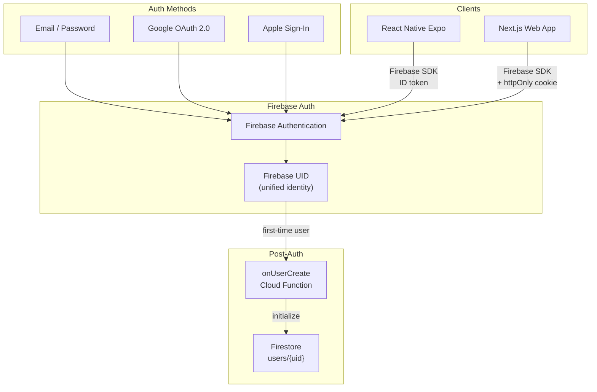
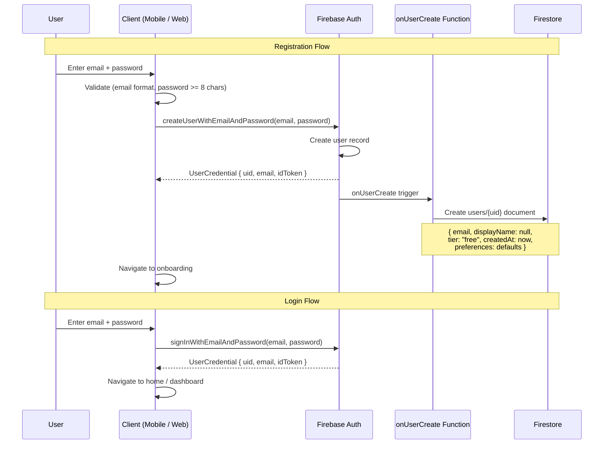
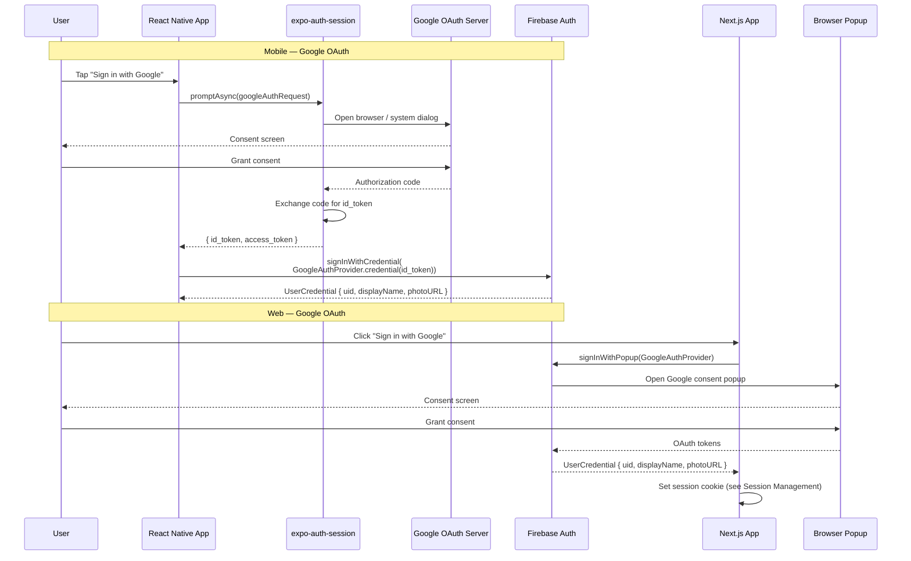
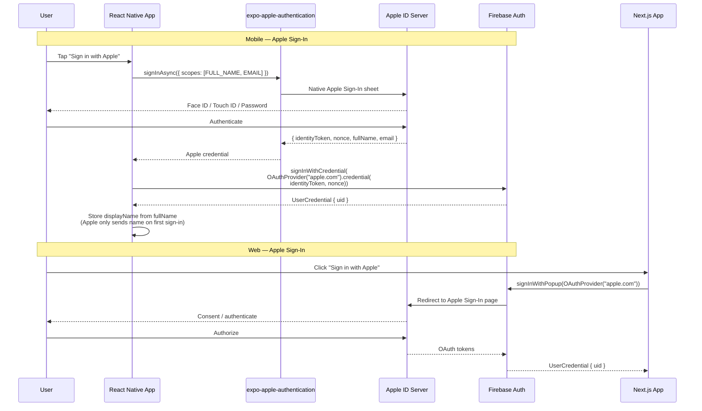
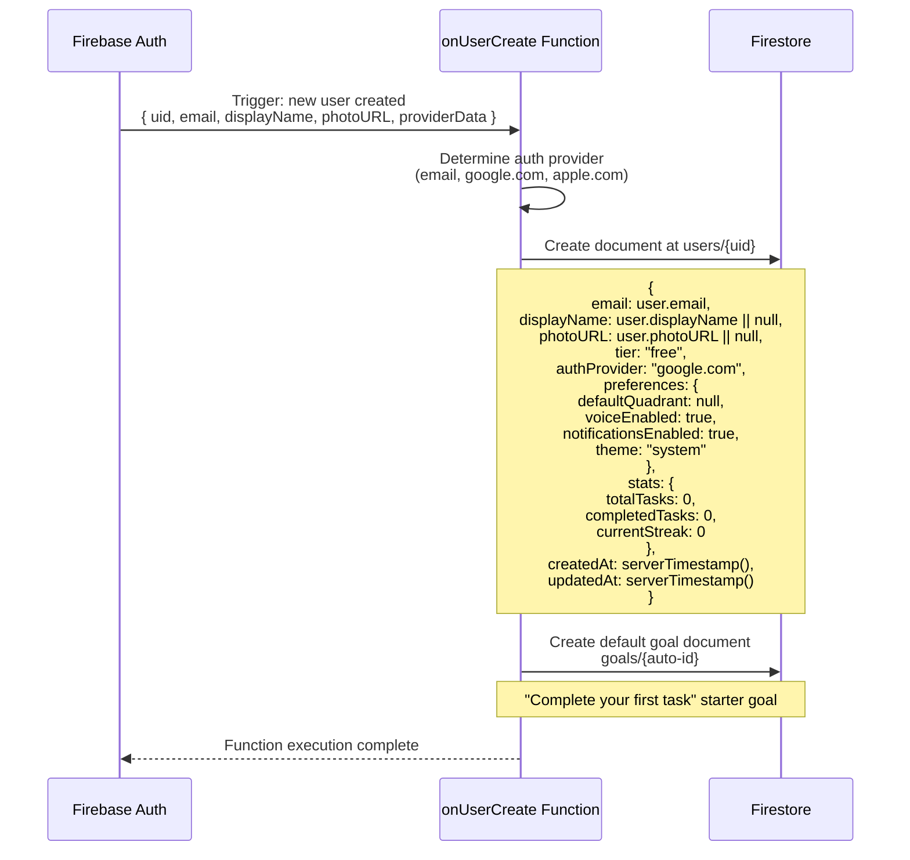
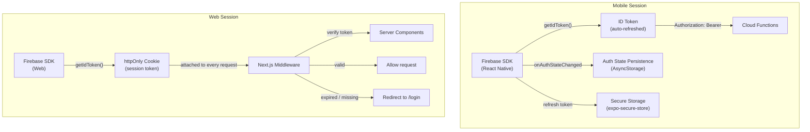

# Authentication Flow

This document describes the authentication architecture for MapMyActivities, covering email/password, Google OAuth, and Apple Sign-In flows for both mobile and web clients. It also covers user document initialization and session management.

## Auth Provider Overview



## Email Registration and Login



## Google OAuth Flow



## Apple Sign-In Flow



## onUserCreate — User Document Initialization



## Session Management



## Web Session Cookie Flow

```mermaid
sequenceDiagram
    participant Browser as Browser
    participant NextJS as Next.js Server
    participant MW as Middleware
    participant FA as Firebase Auth
    participant AdminSDK as Firebase Admin SDK

    Note over Browser,AdminSDK: Login — Set Cookie
    Browser->>FA: signInWithPopup / signInWithEmailAndPassword
    FA-->>Browser: UserCredential + ID token
    Browser->>NextJS: POST /api/auth/login { idToken }
    NextJS->>AdminSDK: verifyIdToken(idToken)
    AdminSDK-->>NextJS: Decoded token (valid)
    NextJS->>AdminSDK: createSessionCookie(idToken, { expiresIn: 14 days })
    AdminSDK-->>NextJS: Session cookie value
    NextJS-->>Browser: Set-Cookie: session={value}; HttpOnly; Secure; SameSite=Lax; Path=/

    Note over Browser,AdminSDK: Subsequent Requests
    Browser->>MW: GET /dashboard (cookie attached)
    MW->>AdminSDK: verifySessionCookie(cookie)
    AdminSDK-->>MW: Decoded claims { uid, email }
    MW->>MW: Inject user context into request headers
    MW-->>Browser: Allow — render page

    Note over Browser,AdminSDK: Logout
    Browser->>NextJS: POST /api/auth/logout
    NextJS->>AdminSDK: revokeRefreshTokens(uid)
    NextJS-->>Browser: Set-Cookie: session=; Max-Age=0
    Browser->>Browser: firebase.auth().signOut()
    Browser->>Browser: Redirect to /login
```

## Protected Routes

| Platform | Mechanism | Behavior on Unauthenticated |
|----------|-----------|---------------------------|
| Mobile | `onAuthStateChanged` listener in root navigator | Redirect to Login stack |
| Web (CSR) | `onAuthStateChanged` + React context provider | Redirect to `/login` |
| Web (SSR) | Next.js middleware checks session cookie | 307 redirect to `/login` |
| Web (API) | `verifySessionCookie` in API route handler | 401 Unauthorized response |
| Cloud Functions | `verifyIdToken` from Authorization header | 401 Unauthorized response |
