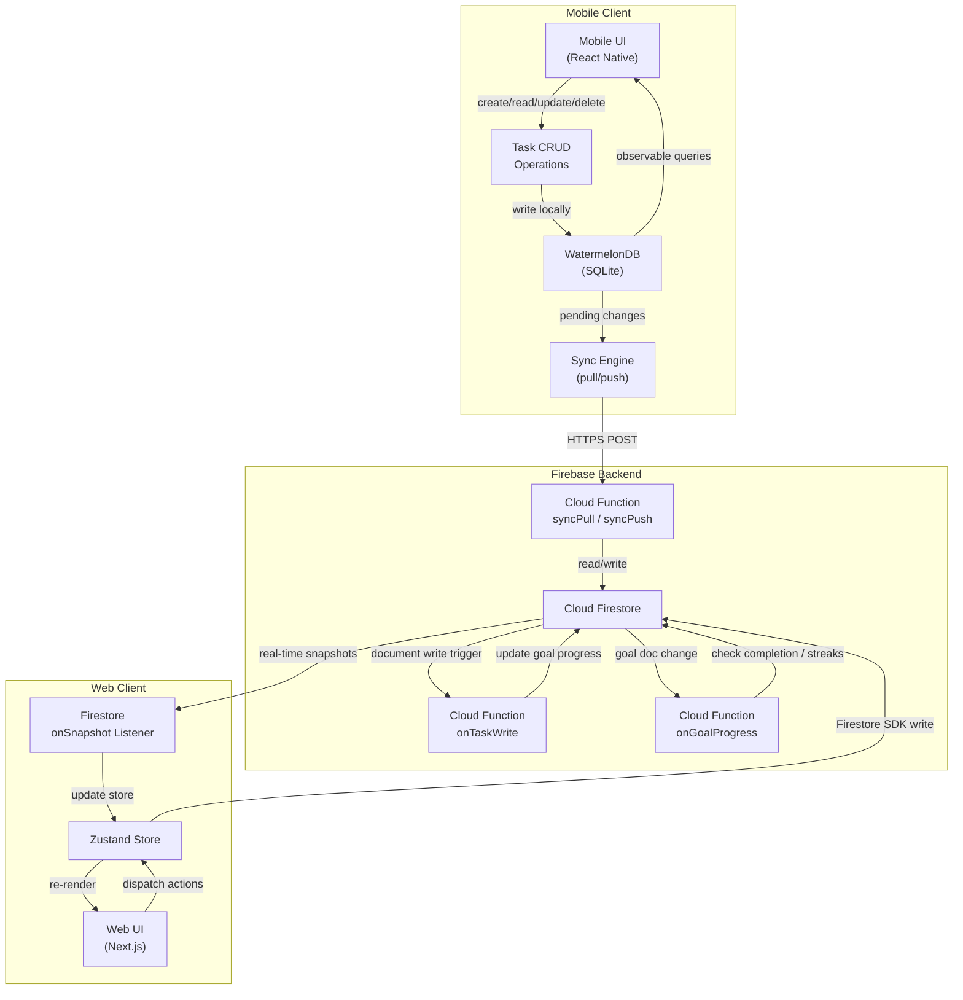
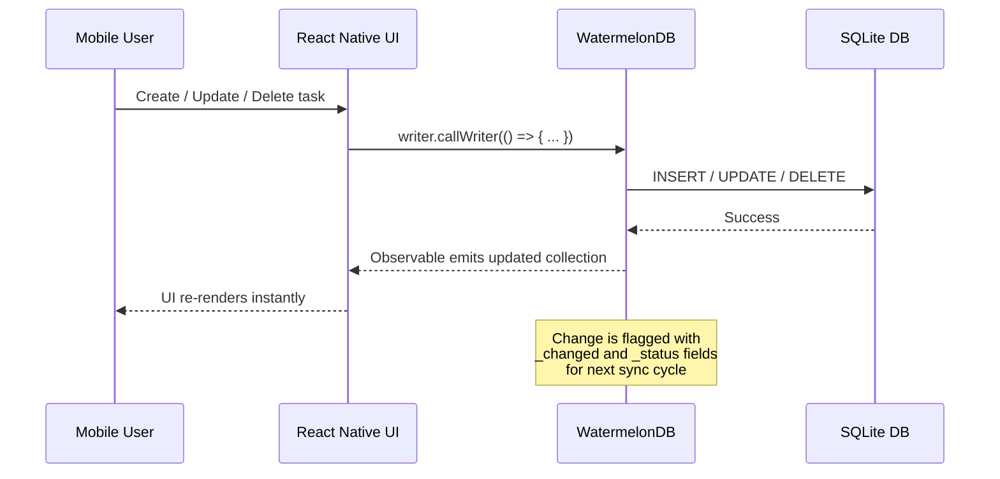
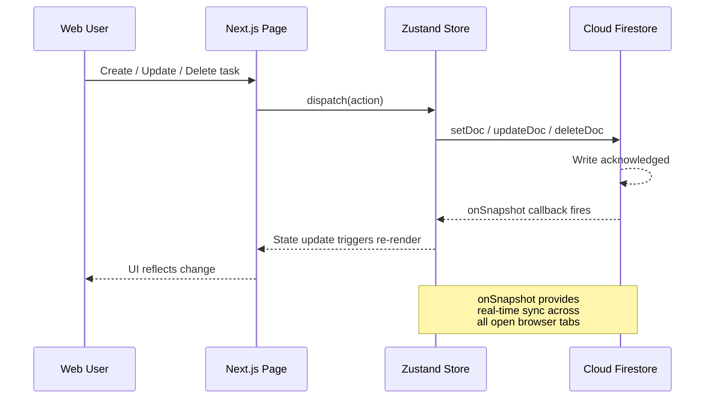
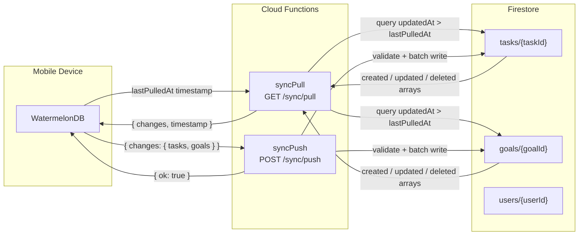
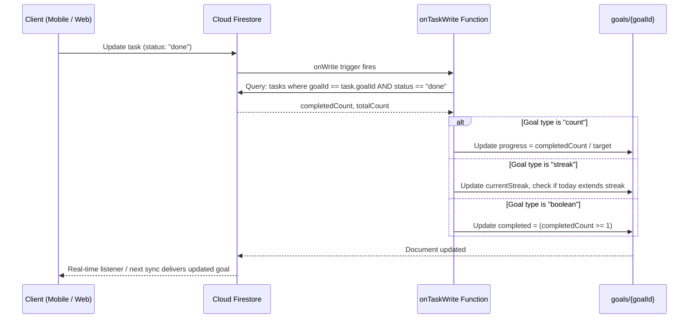
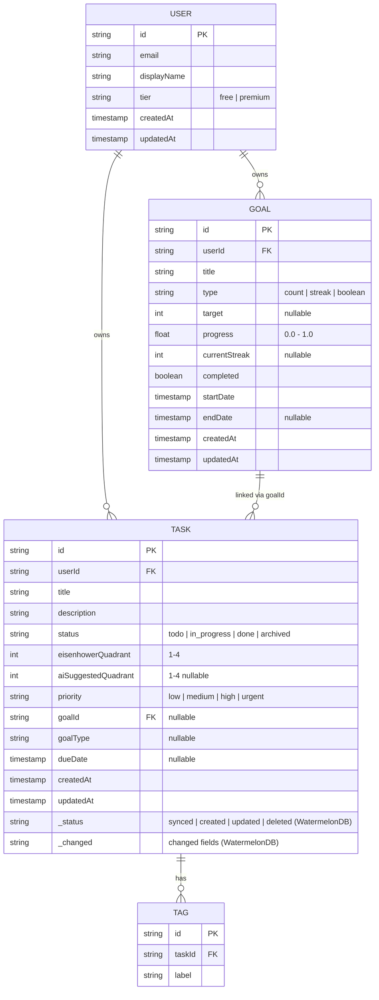

# Data Flow Architecture

This document describes how data moves through the MapMyActivities system, covering task CRUD operations, synchronization between mobile and web clients, real-time updates, and goal completion tracking.

## High-Level Data Flow

## Task CRUD — Mobile (WatermelonDB)

## Task CRUD — Web (Zustand + Firestore)

## Sync: Mobile to Firestore

## Goal Completion Tracking

## Data Model Summary

