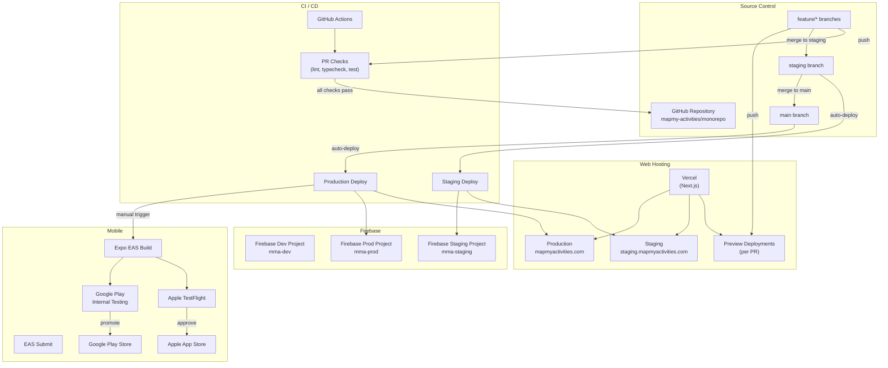
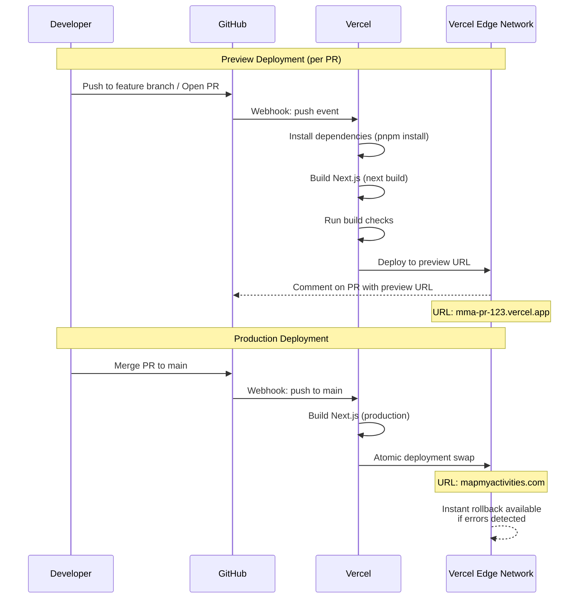
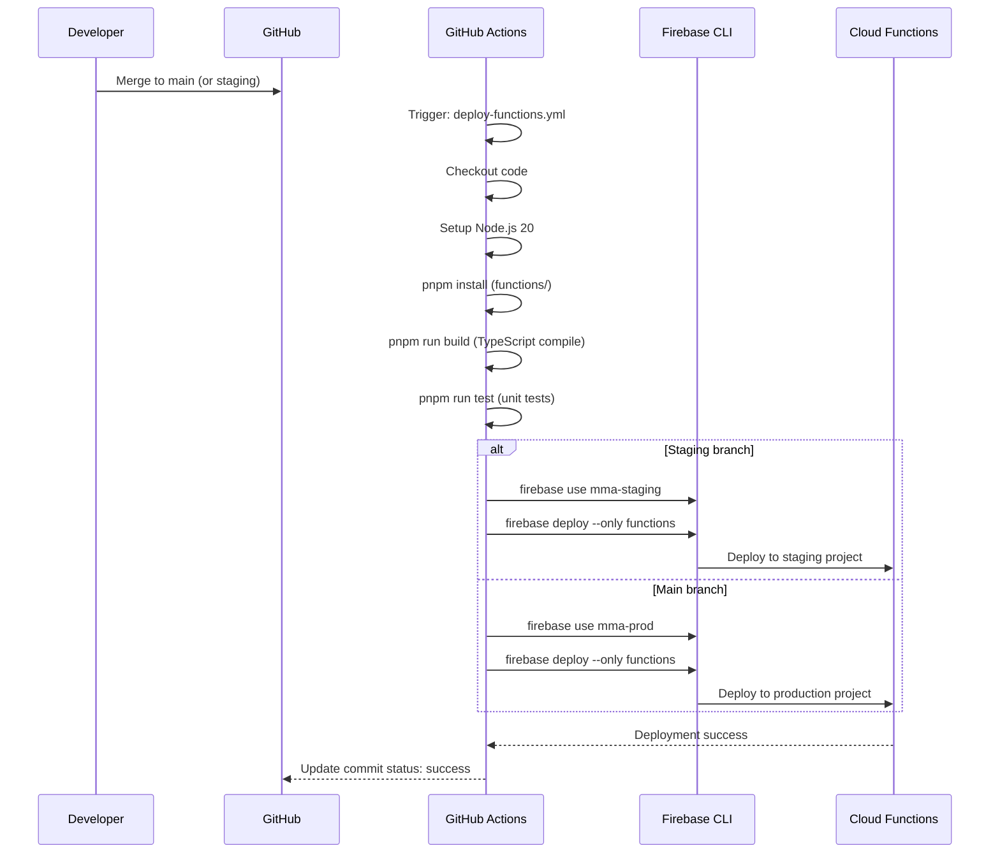
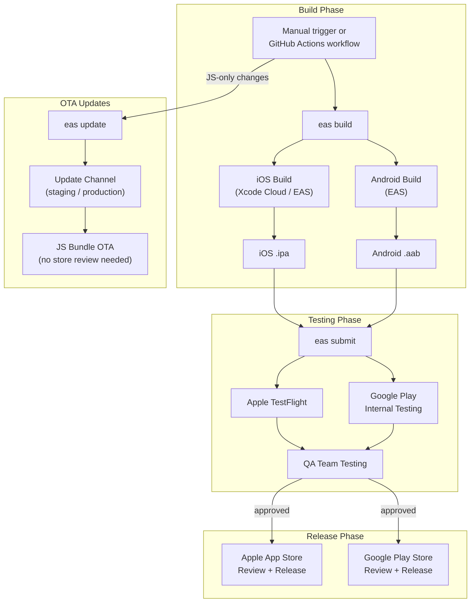
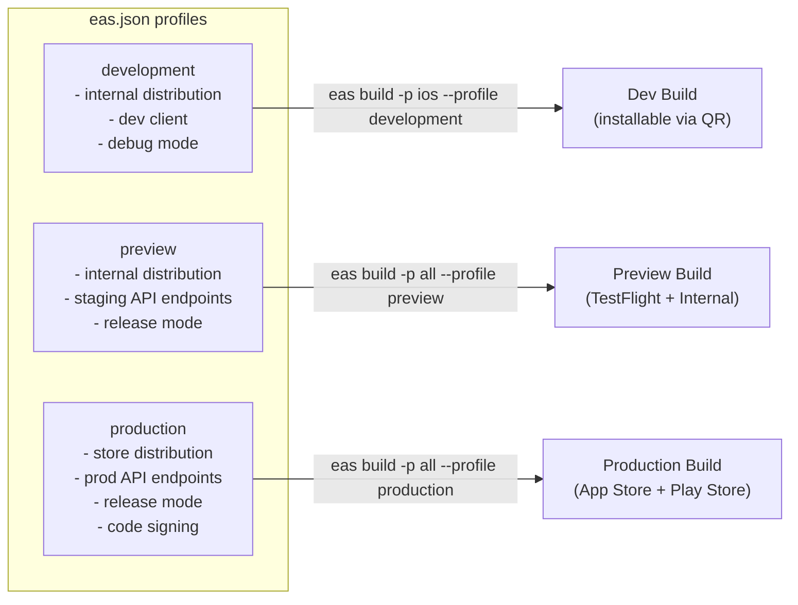
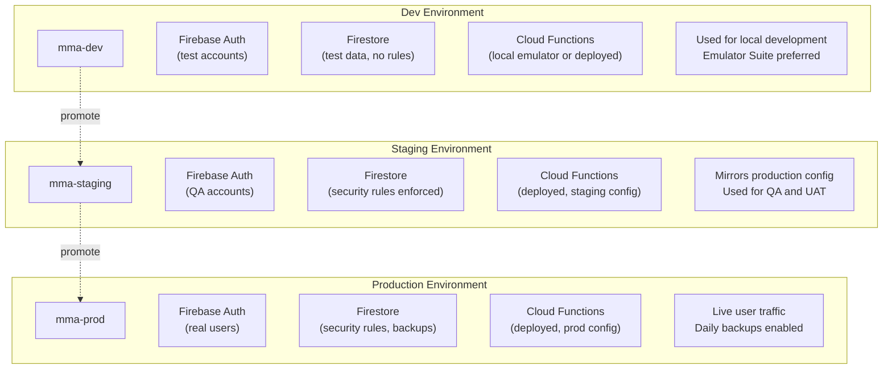
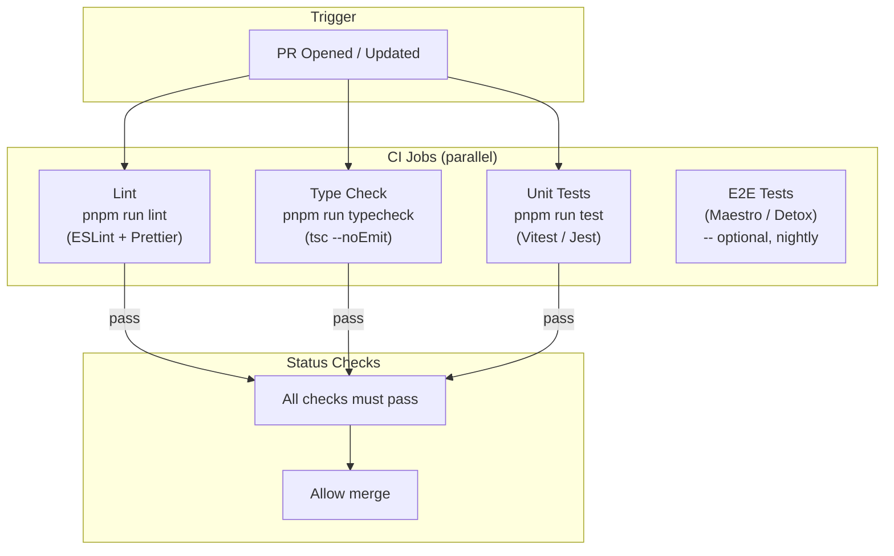
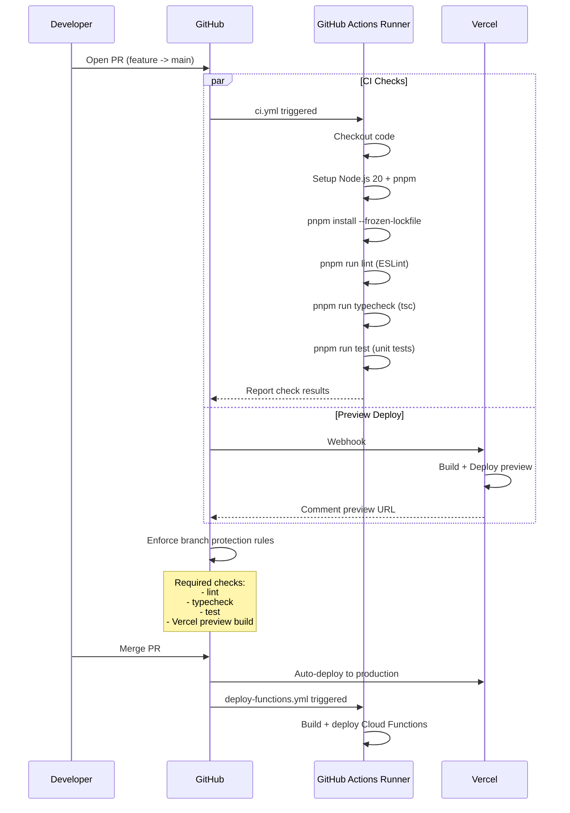

# Deployment Architecture

This document describes the deployment infrastructure for MapMyActivities, covering web hosting, serverless functions, mobile app builds, environment management, and CI/CD pipelines.

## Deployment Overview

## Web Deployment — Vercel (Next.js)

## Firebase Functions Deployment

## Mobile Build and Release — Expo EAS

## EAS Build Profiles

## Firebase Project Environments

## CI Pipeline — GitHub Actions

## CI Workflow Detail

## Environment Variables and Secrets

| Secret | Stored In | Used By |
|--------|-----------|---------|
| `FIREBASE_SERVICE_ACCOUNT_DEV` | GitHub Secrets | CI: deploy to dev |
| `FIREBASE_SERVICE_ACCOUNT_STAGING` | GitHub Secrets | CI: deploy to staging |
| `FIREBASE_SERVICE_ACCOUNT_PROD` | GitHub Secrets | CI: deploy to prod |
| `ANTHROPIC_API_KEY` | Firebase Functions config | Cloud Functions: Claude API |
| `DEEPGRAM_API_KEY` | Firebase Functions config | Cloud Functions: Deepgram (proxy for mobile) |
| `EXPO_TOKEN` | GitHub Secrets | CI: EAS Build + Submit |
| `VERCEL_TOKEN` | GitHub Secrets (auto via integration) | Vercel deployments |
| `NEXT_PUBLIC_FIREBASE_*` | Vercel env vars | Next.js client-side Firebase config |
| `FIREBASE_ADMIN_*` | Vercel env vars (server) | Next.js API routes / server components |
