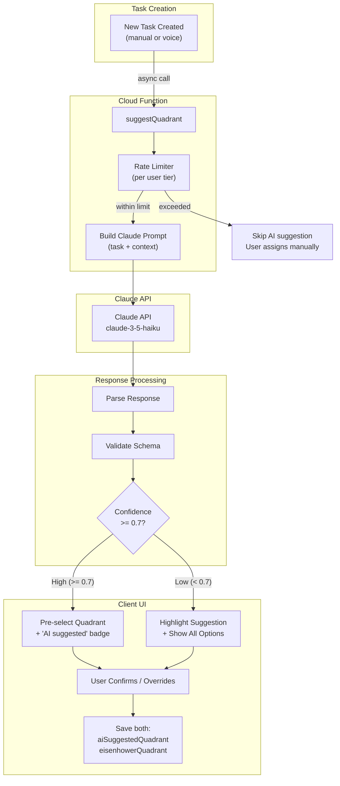
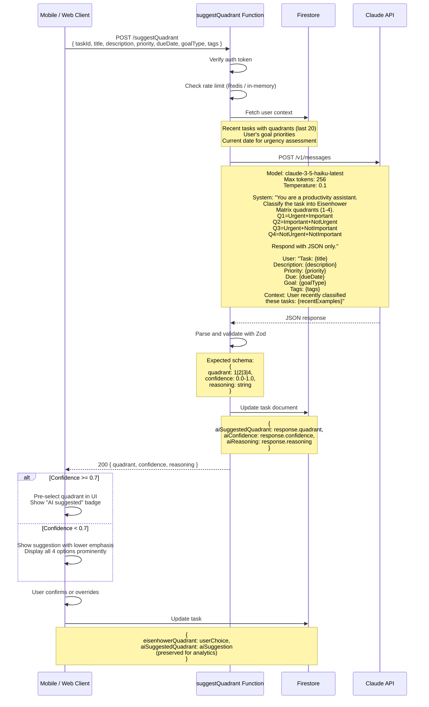
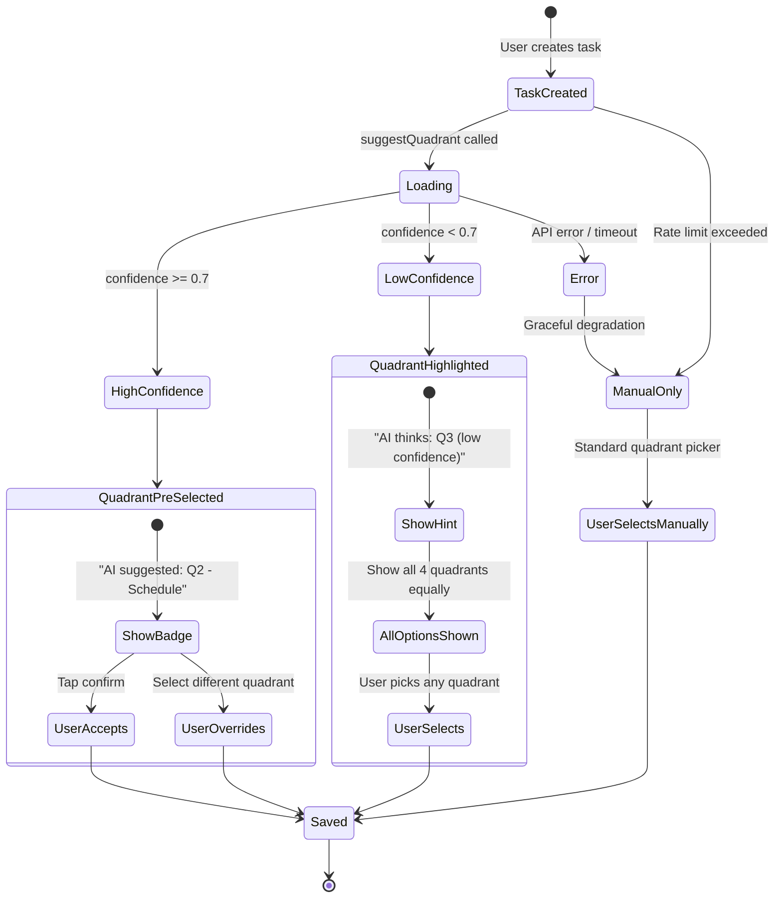
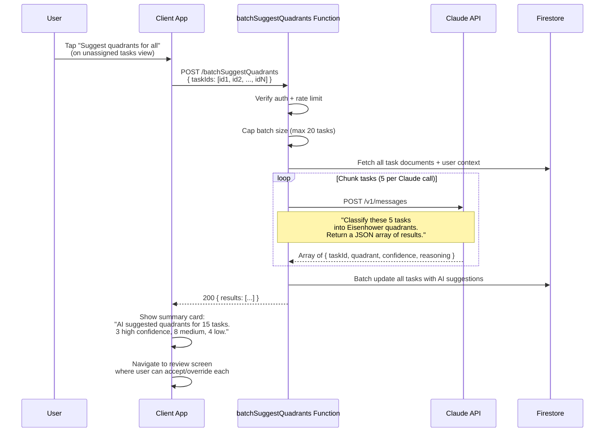
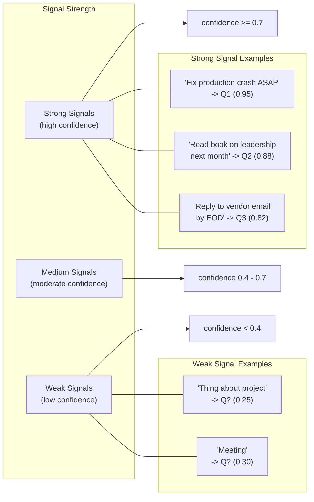
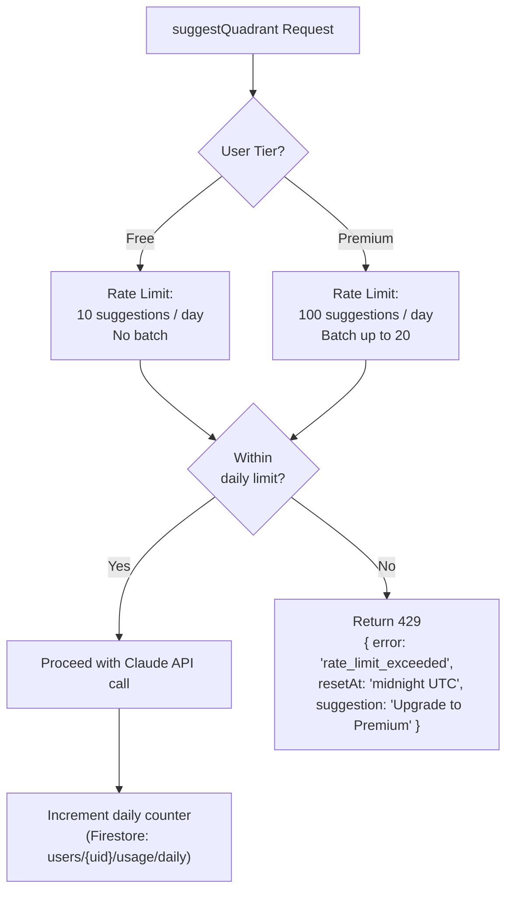

# Eisenhower Matrix AI Suggestion Flow

This document describes how MapMyActivities uses the Claude API to automatically suggest Eisenhower Matrix quadrant assignments for tasks. The system provides intelligent suggestions while always preserving user agency to accept or override them.

## Quadrant Reference

```mermaid
quadrantChart
    title Eisenhower Matrix
    x-axis Low Urgency --> High Urgency
    y-axis Low Importance --> High Importance
    quadrant-1 Q1: Do First (Urgent + Important)
    quadrant-2 Q2: Schedule (Important, Not Urgent)
    quadrant-3 Q3: Delegate (Urgent, Not Important)
    quadrant-4 Q4: Eliminate (Not Urgent, Not Important)
```

## Suggestion Flow Overview



## Detailed Suggestion Sequence



## UI States



## Batch Suggestion for Unassigned Tasks



## Confidence Calibration



## Rate Limiting



## Data Storage

Both the AI-suggested quadrant and the user's final choice are stored on the task document for analytics and model improvement.

| Field | Type | Description |
|-------|------|-------------|
| `eisenhowerQuadrant` | `1 \| 2 \| 3 \| 4` | The user's final quadrant assignment |
| `aiSuggestedQuadrant` | `1 \| 2 \| 3 \| 4 \| null` | The AI's suggestion (null if not requested) |
| `aiConfidence` | `number (0-1) \| null` | Confidence score of the AI suggestion |
| `aiReasoning` | `string \| null` | Brief reasoning from Claude (for transparency) |
| `quadrantSource` | `"manual" \| "ai_accepted" \| "ai_overridden"` | How the quadrant was assigned |
