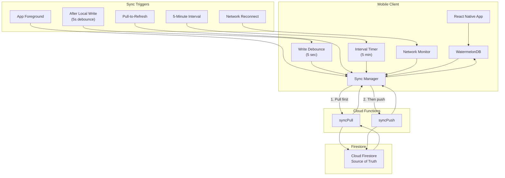
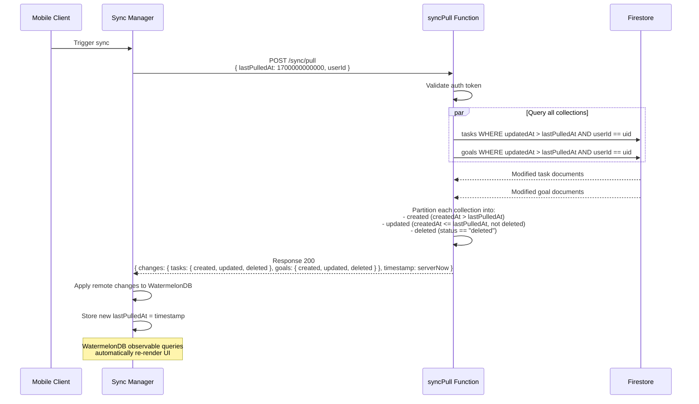
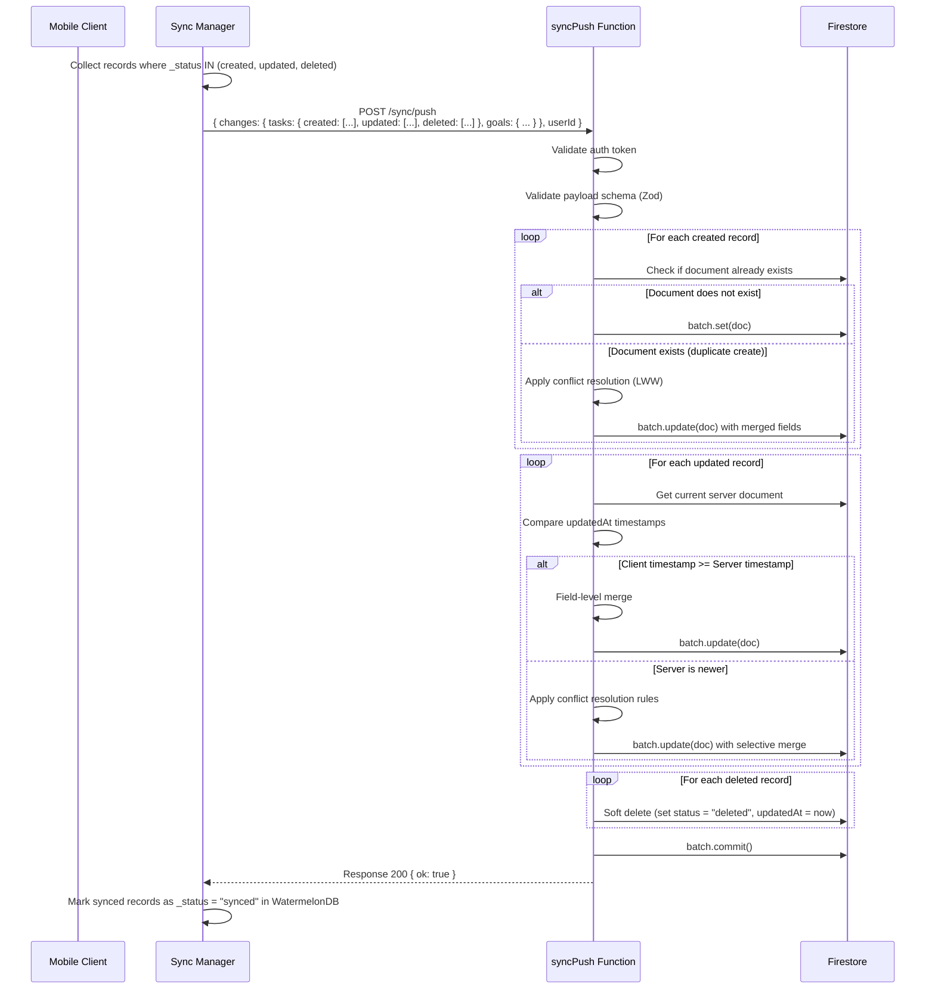
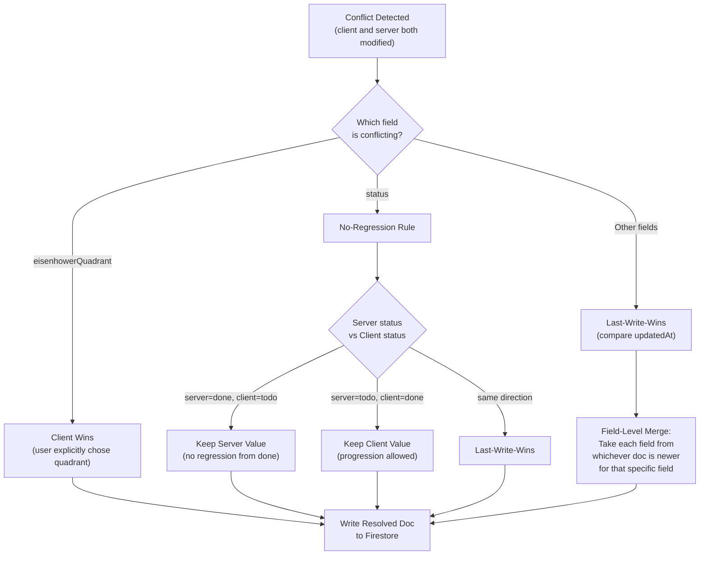
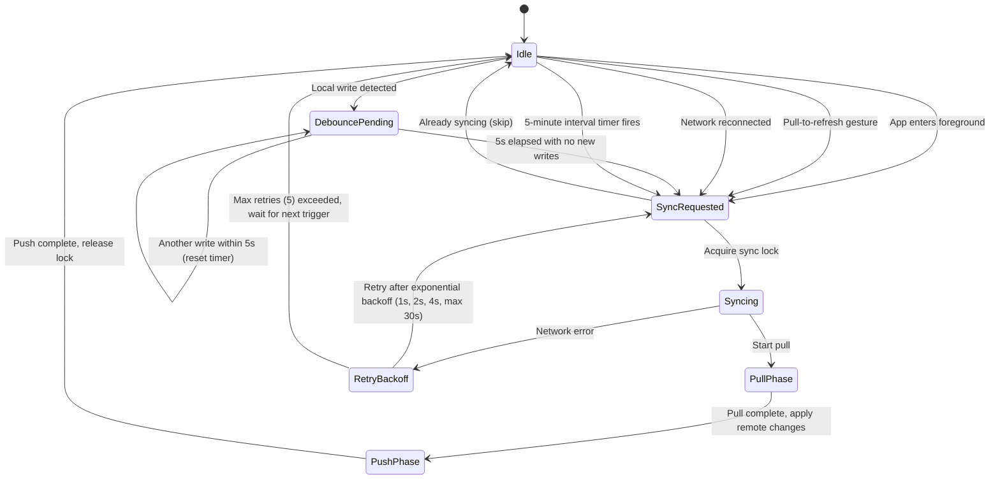
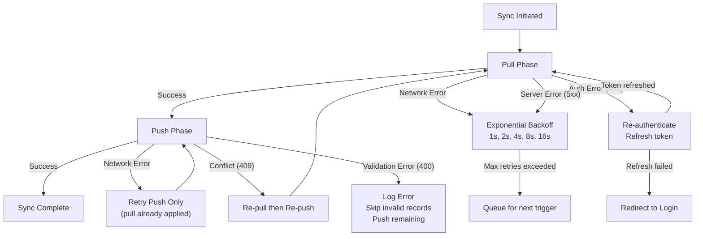

# Sync Architecture

This document details the synchronization mechanism between the React Native mobile app (WatermelonDB / SQLite) and Cloud Firestore. The sync protocol follows a pull-then-push pattern with last-write-wins conflict resolution and field-level merging.

## Sync Overview

## Pull Flow

The client sends its `lastPulledAt` timestamp. The server queries Firestore for all documents modified after that timestamp and returns them categorized as created, updated, or deleted.

## Push Flow

The client collects all locally modified records (flagged by WatermelonDB's `_status` field) and sends them to the server. The server validates and applies them with conflict resolution.

## Conflict Resolution Strategy

## Conflict Resolution Rules

| Field | Strategy | Rationale |
|-------|----------|-----------|
| `eisenhowerQuadrant` | **Client wins** | User explicitly assigns quadrant; AI suggestion is advisory only |
| `aiSuggestedQuadrant` | **Server wins** | AI suggestion is computed server-side; client should not override |
| `status` | **No-regression** | Progression order: `todo` -> `in_progress` -> `done` -> `archived`. Never move backward. |
| `title`, `description` | **LWW (field-level)** | Compare per-field `updatedAt` if available, else document-level |
| `priority`, `dueDate` | **LWW** | Standard last-write-wins |
| `tags` | **Union merge** | Combine tags from both sides, deduplicate |
| `goalId` | **Client wins** | User explicitly links task to goal |

## Sync Trigger Conditions

## Error Handling and Retry

