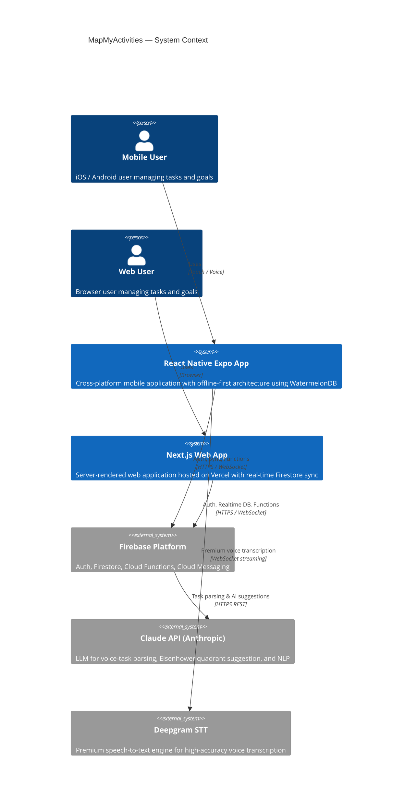
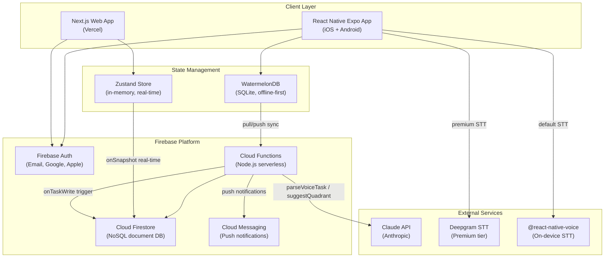

# System Overview

A C4-style system context diagram showing the high-level architecture of MapMyActivities. The platform consists of a React Native Expo mobile app and a Next.js web app, both backed by Firebase services and enhanced with AI capabilities via the Claude API and Deepgram speech-to-text.

## System Context Diagram

## Component Breakdown

## Key Architectural Decisions

| Decision | Choice | Rationale |
|----------|--------|-----------|
| Mobile framework | React Native + Expo | Cross-platform with native performance, OTA updates via EAS |
| Offline storage | WatermelonDB (SQLite) | Lazy-loading, observable queries, built-in sync primitives |
| Web state | Zustand + Firestore onSnapshot | Lightweight store with real-time server sync |
| Auth provider | Firebase Auth | Multi-provider (Email, Google, Apple) with minimal setup |
| AI / NLP | Claude API (Anthropic) | Strong instruction-following for structured extraction |
| Voice (default) | @react-native-voice | Free, on-device, no network dependency |
| Voice (premium) | Deepgram | Higher accuracy, streaming, punctuation, speaker diarization |
| Backend | Cloud Functions (Firebase) | Tight Firestore integration, event-driven triggers |
| Web hosting | Vercel | Native Next.js support, edge functions, preview deploys |
