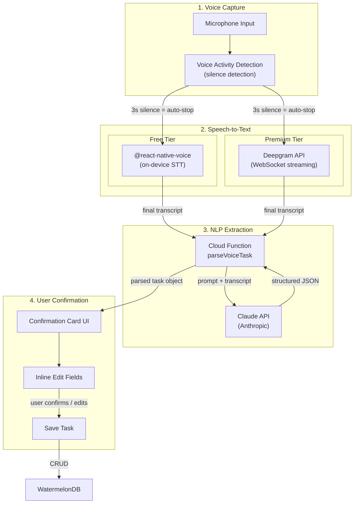
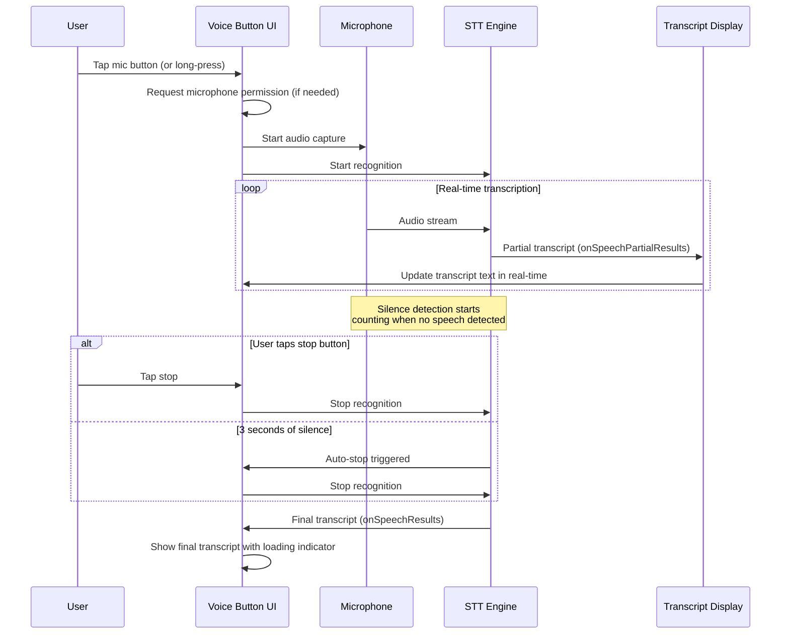
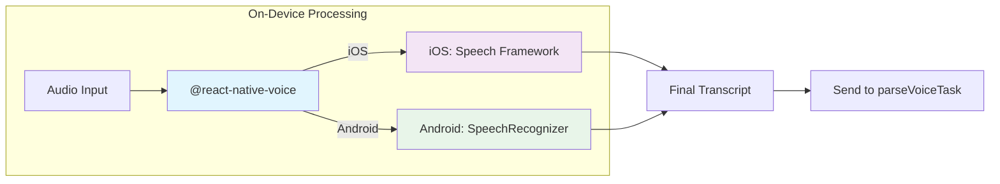
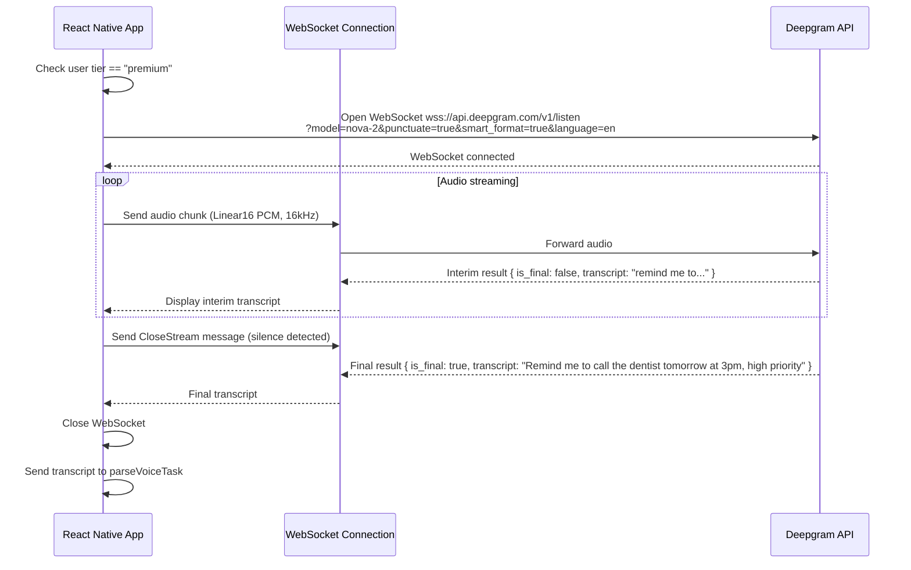
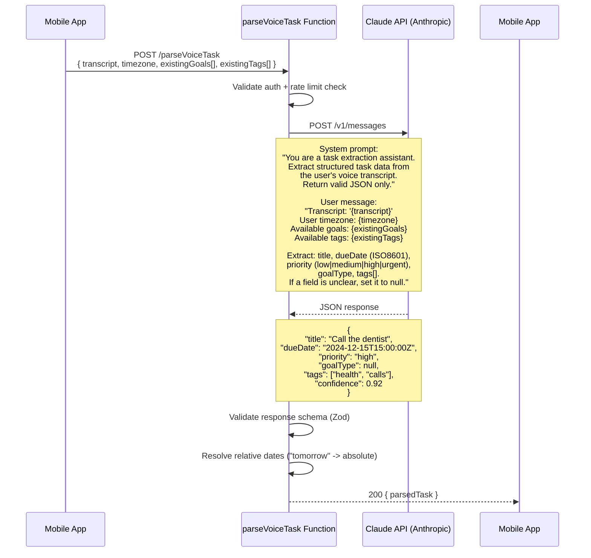
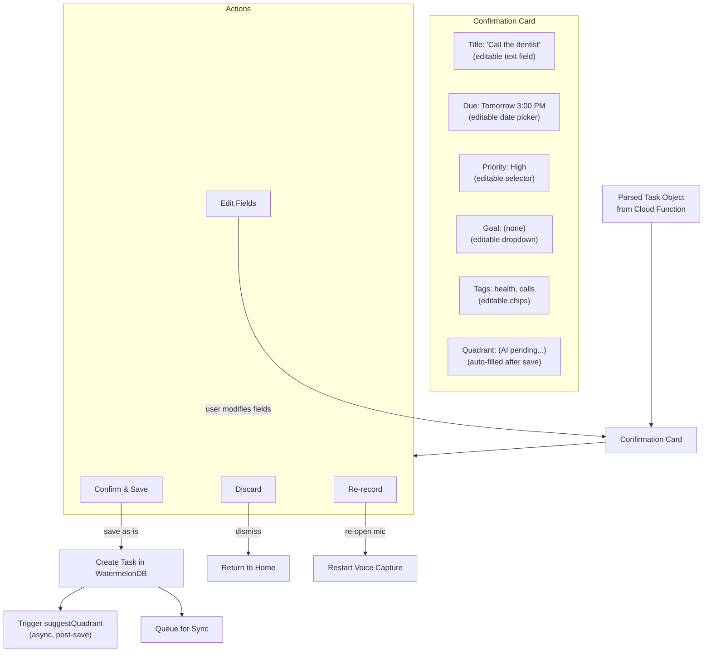
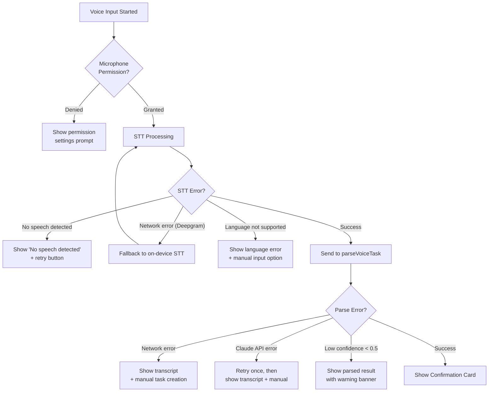

# Voice Assistant Pipeline

This document describes the end-to-end voice input pipeline for creating tasks in MapMyActivities. The system supports on-device speech-to-text for free users and Deepgram streaming STT for premium users, with Claude API powering natural language extraction of task attributes.

## Pipeline Overview

## Voice Capture and STT — Detailed Flow

## Free Tier: On-Device STT

## Premium Tier: Deepgram Streaming STT

## NLP Extraction via Claude API

## Confirmation Card UI Flow

## Error Handling

## Rate Limiting

| User Tier | Voice Commands / Day | Deepgram Minutes / Month | Claude Calls / Day |
|-----------|---------------------|-------------------------|-------------------|
| Free      | 20                  | N/A (on-device only)    | 20                |
| Premium   | Unlimited           | 120 minutes             | 200               |
